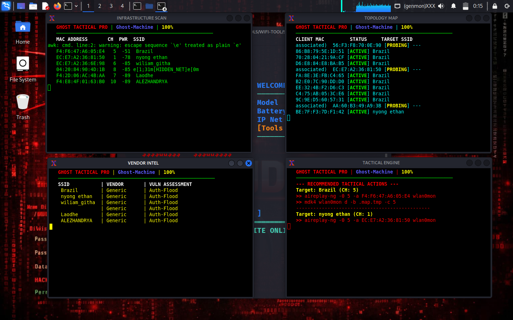
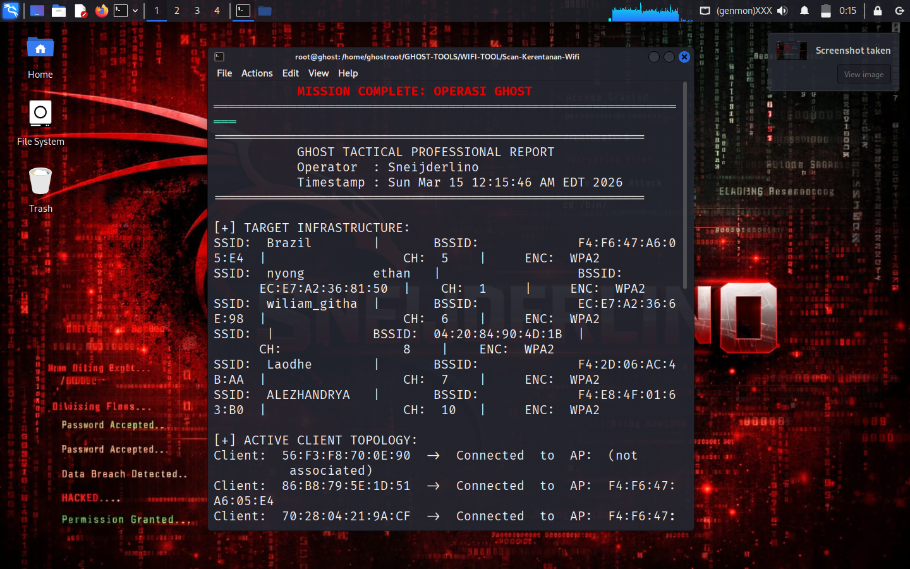

# 🔥 Ghost Vuln Scanner WiFi

<p align="center">
  
  
  
  
</p>

<p align="center">
  
</p>

---

## 🧪 Tentang Ghost Vuln Scanner WiFi

**Ghost Vuln Scanner WiFi** adalah _tool_ keamanan jaringan Wi-Fi yang dirancang untuk membantu pentester dan operator red team melakukan pemetaan, audit, dan analisis cepat terhadap infrastruktur nirkabel.

Dengan tampilan terminal bergaya _hacker_, Ghost memberi visibilitas real-time ke: SSID, BSSID, topologi klien, vendor, dan rekomendasi aksi taktis.

> ⚠️ **Disclaimer penting**: Gunakan tool ini hanya untuk pengujian yang sah (authorized testing). Jangan gunakan pada jaringan tanpa izin eksplisit.

---

## 🧭 Daftar Isi

1. [Fitur Utama Tool](#-fitur-utama-tool)
2. [Preview Tool](#-preview-tool)
3. [Struktur Folder Project](#-struktur-folder-project)
4. [Cara Instalasi](#-cara-instalasi)
   - [Windows](#windows)
   - [Kali Linux](#kali-linux)
   - [Termux](#termux)
5. [Cara Menjalankan Program](#-cara-menjalankan-program)
6. [Dependencies](#-dependencies)
7. [Contoh Penggunaan](#-contoh-penggunaan)
8. [Warning / Disclaimer](#-warning--disclaimer)
9. [Kontribusi](#-kontribusi)
10. [Lisensi](#-lisensi)
11. [Kontak Developer](#-kontak-developer)

---

## ✨ Fitur Utama Tool

- 🔥 **Realtime WiFi Recon**: Menampilkan SSID, BSSID, kanal, dan kekuatan sinyal.
- 🧩 **Topology Mapping**: Menunjukkan hubungan client ↔️ access point secara dinamis.
- 🛠 **Vendor Fingerprinting**: Klasifikasi vendor perangkat dan rekomendasi vektor serangan.
- 🎯 **Tactical Action Feed**: Saran perintah `aireplay-ng` dan `mdk4` untuk serangan/tes lanjutan.
- 📄 **Laporan Otomatis**: Hasil scan tersimpan ke `GHOST_FINAL_AUDIT.txt` saat berhenti.
- 🖥 **UI Terminal Retro**: Tampilan warna terminal ala war-room dengan jendela xterm terpisah.

---

## 🖼️ Preview Tool

> 🎛️ Tampilan utama Ghost Vuln Scanner WiFi saat berjalan.

<p align="center">
  
</p>
<p align="center">
  
</p>
---

## 🗂️ Struktur Folder Project

```
Ghost-Vuln-Scanner-Wifi/
├── Ghost-Vuln-Scanner-Wifi.sh    # Script utama (bash)
├── LICENSE                      # Lisensi open-source
├── README.md                    # Dokumentasi utama
├── requirements.txt             # Catatan dependensi (non-pip)
├── .gitignore                   # File / folder yang diabaikan git
└── img/
    └── sampel.png               # Preview tool
```

---

## 🛠️ Cara Instalasi

### 🪟 Windows

1. **Install Python (opsional)**
   - Kunjungi https://www.python.org/ dan unduh Python 3.11+.
   - Pastikan centang “Add Python to PATH”.

2. **Clone Repository**

   ```bash
   git clone https://github.com/Sneijderlino/Ghost-Vuln-Scanner-Wifi.git
   cd Ghost-Vuln-Scanner-Wifi
   ```

3. **Install Dependency (Windows Subsystem atau Linux)**
   - Ghost dirancang untuk berjalan pada lingkungan Linux/Termux.
   - Pastikan menginstal `aircrack-ng`, `xterm`, dan `sudo` (jika diperlukan).

4. **Jalankan Program**
   ```bash
   bash Ghost-Vuln-Scanner-Wifi.sh
   ```

---

### 🐧 Kali Linux

1. **Clone Repository**

   ```bash
   git clone https://github.com/Sneijderlino/Ghost-Vuln-Scanner-Wifi.git
   cd Ghost-Vuln-Scanner-Wifi
   ```

2. **Install Python 3 (jika belum ada)**

   ```bash
   sudo apt update && sudo apt install -y python3
   ```

3. **Install pip (jika belum ada)**

   ```bash
   sudo apt install -y python3-pip
   ```

4. **Install Dependencies**

   ```bash
   sudo apt install -y aircrack-ng xterm
   ```

5. **Jalankan Program**
   ```bash
   bash Ghost-Vuln-Scanner-Wifi.sh
   ```

---

### 📱 Termux (Android)

1. **Update & Upgrade**

   ```bash
   pkg update
   pkg upgrade
   ```

2. **Install Git & Python**

   ```bash
   pkg install git
   pkg install python
   ```

3. **Clone Repository**

   ```bash
   git clone https://github.com/Sneijderlino/Ghost-Vuln-Scanner-Wifi.git
   cd Ghost-Vuln-Scanner-Wifi
   ```

4. **Install Dependencies**

   ```bash
   pkg install aircrack-ng xterm
   ```

5. **Jalankan Program**
   ```bash
   bash Ghost-Vuln-Scanner-Wifi.sh
   ```

---

## 📦 Dependencies

Ghost tidak bergantung pada library Python. Tool ini menggunakan utilitas sistem yang harus diinstal secara terpisah:

- `aircrack-ng` (airodump-ng, aireplay-ng)
- `xterm`
- `bash` (sh compatible shell)

> Tip: Pada sistem berbasis Debian/Ubuntu/Kali, jalankan:
> `sudo apt install -y aircrack-ng xterm`

---

## 🧪 Contoh Penggunaan

1. Jalankan tool:

   ```bash
   bash Ghost-Vuln-Scanner-Wifi.sh
   ```

2. Biarkan tool berjalan untuk mengumpulkan data.
3. Tekan `Ctrl+C` untuk berhenti.
4. Hasil audit disimpan ke: `GHOST_FINAL_AUDIT.txt`

---

## ⚠️ Warning / Disclaimer

- **Gunakan hanya pada jaringan yang Anda miliki atau yang Anda miliki izin eksplisit.**
- **Tidak bertanggung jawab atas penyalahgunaan.**
- Tool ini dibuat untuk tujuan edukasi dan pentesting yang sah.

---

## 🤝 Kontribusi

Kontribusi dipersilakan! Jika Anda ingin menambahkan fitur baru atau perbaikan:

1. Fork repository ini
2. Buat branch fitur: `git checkout -b fitur-xyz`
3. Commit perubahan Anda
4. Push dan buat Pull Request

---

## 📜 Lisensi

Ghost Vuln Scanner Wifi dirilis di bawah lisensi **MIT**. Lihat file [LICENSE](LICENSE) untuk detail.

---

## 📬 Kontak Developer

- **Nama**: Sneijderlino
- **GitHub**: https://github.com/Sneijderlino

---

<p align="center">
  <sub>Ditulis dengan gaya terminal hitam-merah. Stay stealthy, stay legal.</sub>
</p>
# Ghost-Vuln-Scanner-Wifi
